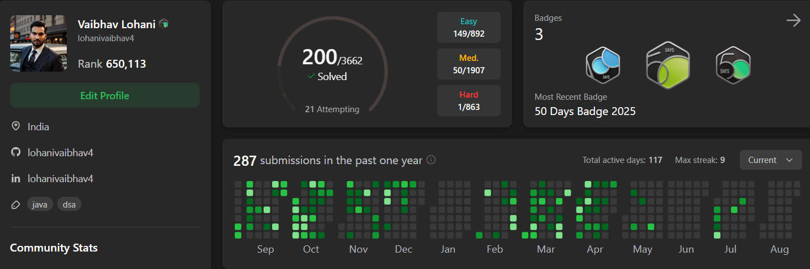

<!-- Banner -->

  

<h1 align="center">👋 Hi, I'm Vaibhav Lohani</h1>
<h3 align="center">🚀 MERN Stack Developer</h3>

---

## 🧑‍💻 About Me  
- 💻 Full-stack developer skilled in **MERN stack**, with growing expertise in **AI-driven web solutions**  
- 🚀 Built projects like **Superio - Job Portal, Vanlife - Van Booking App**,       demonstrating hands-on experience in modern web development  
- 🎯 Focused on building a strong **career in software engineering** and contributing to impactful tech teams  
- 🌍 Based in **Raipur, India** | Open to relocation and remote opportunities  

---

## 🛠️ Tech Stack  

  

---

## 🚀 Featured Projects  

  

---

## 📜 Certificates & Achievements  

- 🏆 [Winner - Ideathon'24 - (Healthcare Technology)](https://drive.google.com/file/d/1iRHNYY2_x9dKB2u7exscRPEYQYCTw-7P/view?usp=drive_link)  

- 🎓 [The Frontend Developement Career Path (Scrimba)](https://scrimba.com/certificate-cert2uNjfK9m1uPPGxcg5oipRrWBfLwRKyR5wrg)  

---
## 🏆 Highlights  

  

---

## 🌐 Connect With Me  

  
  

---

✨ *“Code. Create. Inspire.”*  
