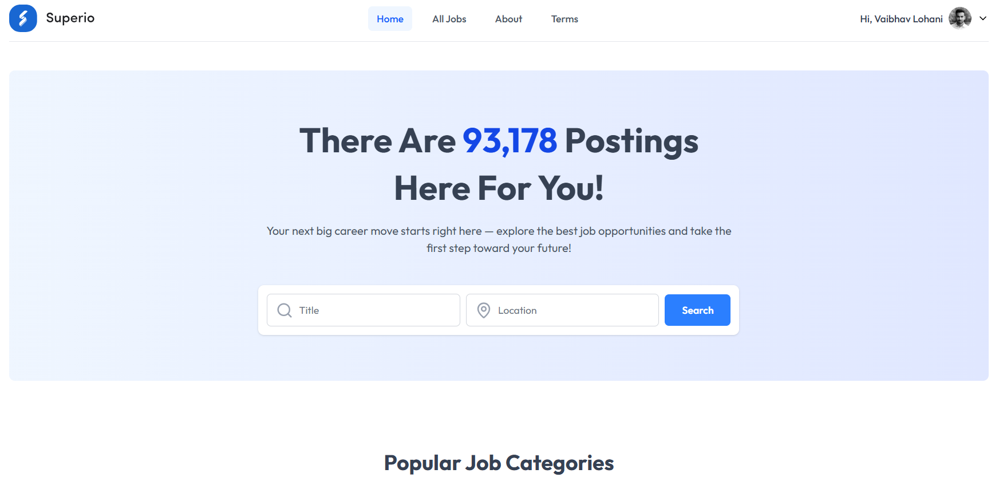
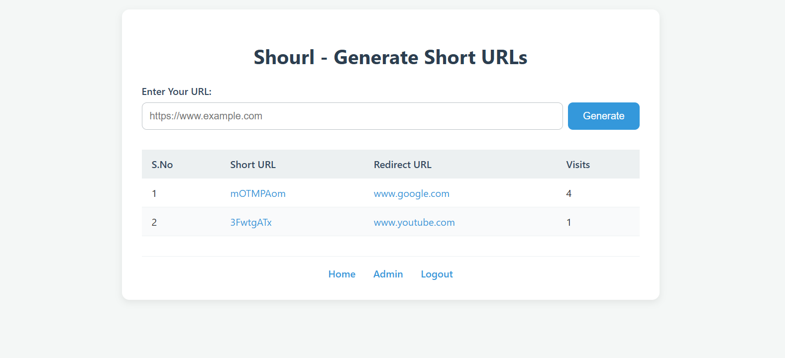

<!-- Banner -->

  

<h1 align="center">👋 Hi, I'm Vaibhav Lohani</h1>
<h3 align="center">🚀 MERN Stack Developer</h3>

---

## 🧑‍💻 About Me  
- 🌱 Currently upskilling in **MERN Stack + AI Integration**  
- 🏗️ Building projects like **Litpost, Vanlife, Shourl**  
- 🎯 Goal: Launch my own **Tech Startup**  
- 📍 Based in **Raipur, India**  

---

## 🛠️ Tech Stack  

  

---

## 🚀 Featured Projects  

  
  

---

## 📊 GitHub Analytics  

  
  
  

---

## 🏆 Achievements & Highlights  

  

---

## 🌐 Connect With Me  

  <a href="https://linkedin.com/in/lohanivaibhav4">
    
  LinkedIn</a>
  <a href="mailto:lohanivaibhav4@gmail.com">
    
  Gmail</a>

---

✨ *“Code. Create. Inspire.”*  
